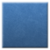
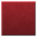
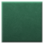
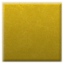
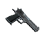
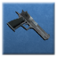

# Custom Weapon Icons
> **IMPORTANT**: Make sure to put your icons in the folder `materials/vgui/ttt/`  
> E.g. [rollermine weapon icon](https://github.com/BadgerCode/TTT-Rollermine/tree/master/materials/vgui/ttt)

# Backgrounds

# Example icon
This folder contains the example icon `icon_example_deagle`

 

These files are required by the client & server to use the icon
* icon_example_deagle.vmt
* icon_example_deagle.vtf
